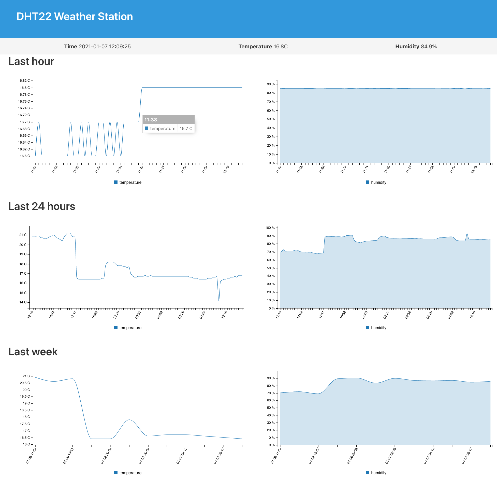

# Pi DHT22

Not being happy with the [DockerPi Sensor Hub](https://github.com/pzac/pi-weather-station) I made another Raspberry Pi weather station, this time based on a DHT22 sensor. Here is how it looks:

## Pi setup

- Install Raspbian
- Update the ansible inventory
- Run the ansible playbook:
    `ansible-playbook playbook.yml`

